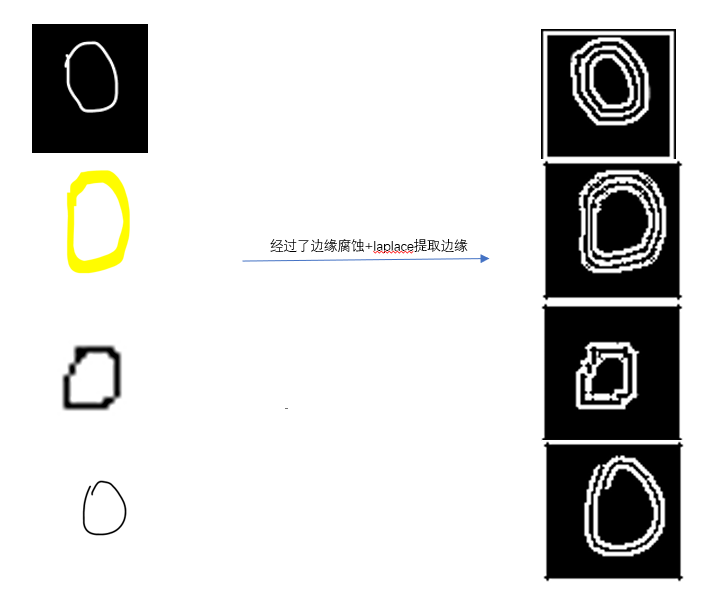
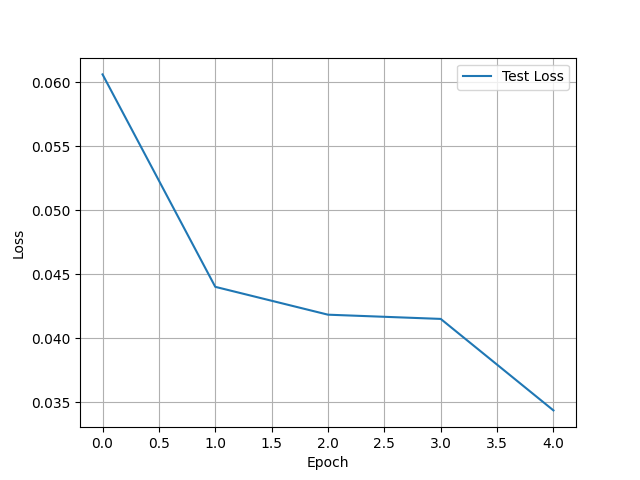
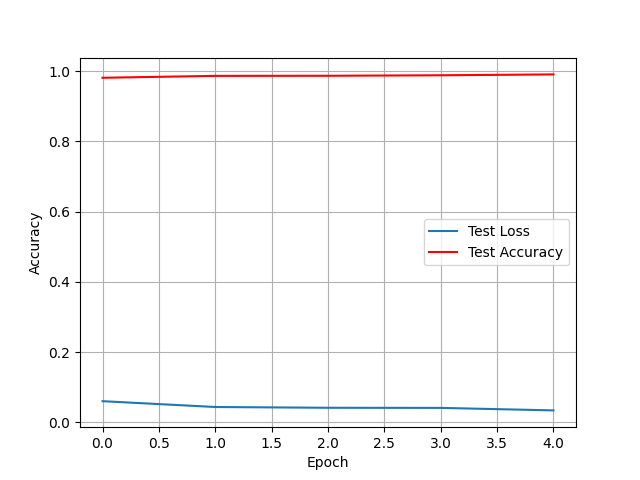
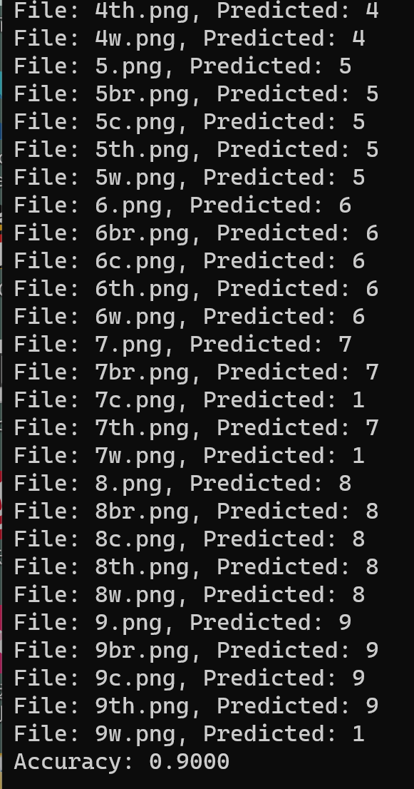

本文介绍如何基于已有的MNIST手写数字数据集，以及卷积神经网络的相关知识，从0搭建一个手写数字识别模型。


# 数字图像处理

​	在生活的世界中，数字的背景、颜色有万千种可能，如果直接将它们输入到模型里面去，模型可能会分不清输入的数字到底是什么颜色，而导致后续无法做出合理的推断。所以，需要使用数字图像处理的相关基础知识，对数据进行处理，使得数据的重要信息能够体现出来（包括边缘轮廓），数据噪声能够尽可能减少，从而帮助模型更好地做出推理。

相关知识：

- laplace卷积核 - 用于提取图像的特征信息 (https://blog.csdn.net/youcans/article/details/122091412) 
  - 代码中使用的是 [[-1, -1, -1], [-1, 8, -1], [-1, -1, -1]]， 这样图片的边缘信息会变白，其它信息会变黑
- erode卷积核 - 用于腐蚀掉图像中较大的边缘，使得数字轮廓更加明显（与膨胀运算相反，这里不需要使用膨胀运算）
  - (https://zhuanlan.zhihu.com/p/164619939)
- 开闭运算 - 用于处理黑白图像的噪声问题  （https://blog.csdn.net/zaishuiyifangxym/article/details/89791458)
  - 好像不使用开闭运算的话，边缘信息更加明显，所以没有使用了

基于上面的先验知识，可以将图片处理成一个黑白的、边缘清晰的图片。



​	把图片处理成黑白的图像之后，还要resize成64x64的固定大小，方便模型进行训练。


# 手写数字识别

上面已经介绍完数据处理的相关部分，下面通过几个步骤就可以训练模型+评估模型的性能。

（1）安装依赖项

```shell
pip install torch==1.13.0+cu116 torchvision==0.14.0+cu116 torchaudio==0.13.0 --extra-index-url https://download.pytorch.org/whl/cu116

pip install matplotlib==3.7.2
pip install numpy==1.23.5
pip install Pillow==10.1.0
pip install torch==2.0.1
pip install torchvision==0.15.2
pip install tqdm==4.65.0
```


（2）训练模型（训练时间比较长，嫌麻烦的同学可以直接跳到第三步）

```shell
python train.py
```

- 输出下面的结果（训练时间可能长达几个小时）


- Loss下降图：



- 因为模型比较好，所以精度一开始就很高，loss一直很低




（3）评估模型的性能

```shell
python evaluate.py
```

- 根据自己的手写数据集进行验证，精度达到了0.9

